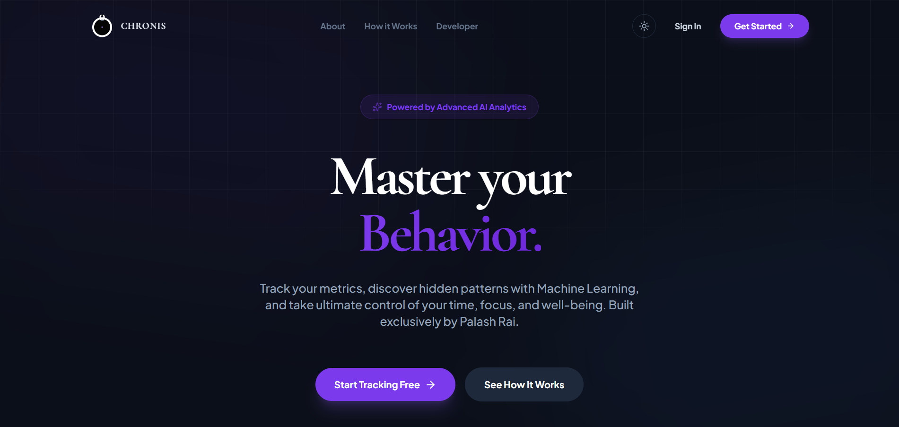
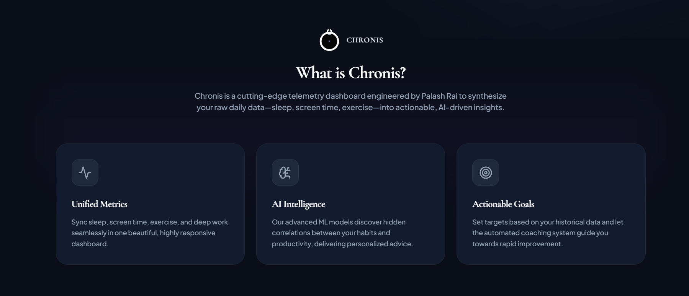
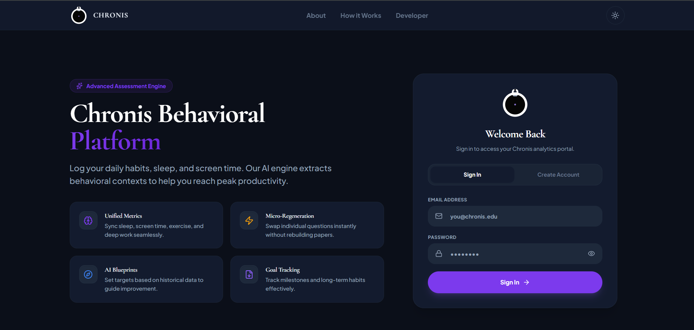
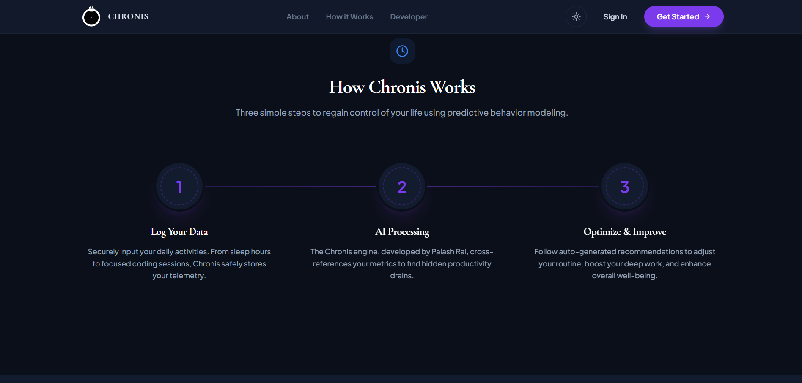
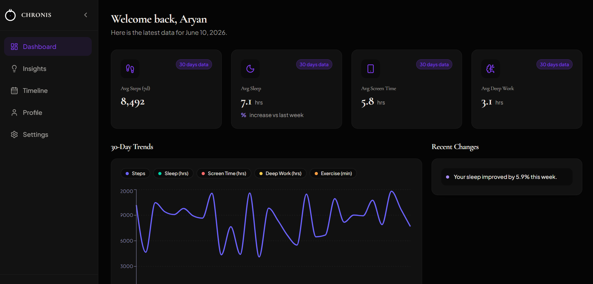
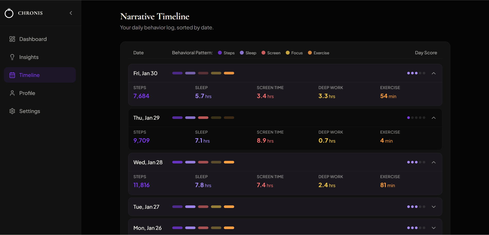
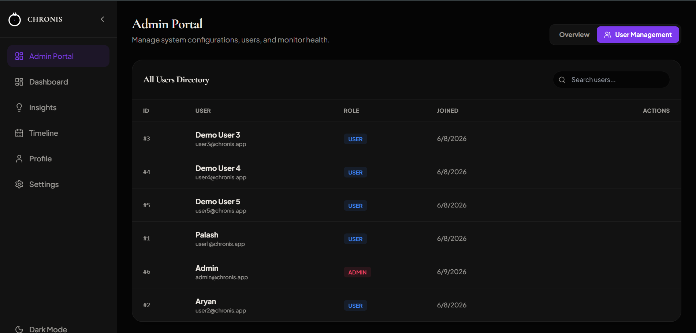
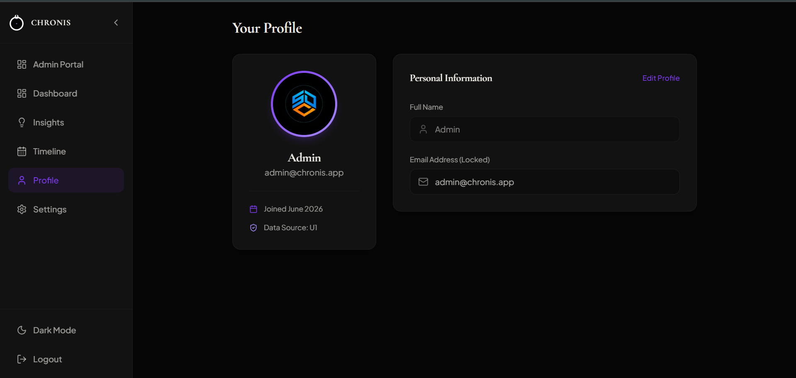

# ⏳ Chronis - Behavioral Analytics Platform

Chronis is a modern, full-stack behavioral analytics web application. It empowers users to track their daily habits (sleep, steps, screen time, deep work, and exercise) and uses data aggregation to surface meaningful insights, 30-day trends, and behavioral correlations.

It features a stunning dark-mode optimized glassmorphism UI, interactive charts, AI-driven insights, and a comprehensive **Admin Portal** for user management.

### 🌟 Live Demo
- **Frontend (Vercel):** [https://chronis-palash.vercel.app](https://chronis-palash.vercel.app/)
- **Backend API (Render):** [https://chronis.onrender.com](https://chronis.onrender.com)
*(Note: Initial backend requests may take 30-50s to wake up the Render free tier server)*

---

### 📸 Application Previews

| | |
|:---:|:---:|
| <br><b>Landing Page</b> | <br><b>About Page</b> |
| <br><b>Login</b> | <br><b>How it works</b> |
| <br><b>User Dashboard</b> | <br><b>Timeline</b> |
| <br><b>Admin Portal</b> | <br><b>Profile Page</b> |

---

## 🛠 Tech Stack

**Frontend Architecture:**
- **React 18** + **Vite** (Blazing fast development & builds)
- **Tailwind CSS** (Utility-first styling, custom dark mode, glassmorphism)
- **Framer Motion** (Micro-animations and page transitions)
- **Recharts** (Interactive data visualization)
- **React Router** (Client-side routing)
- **Lucide React** (Consistent icon system)

**Backend Architecture:**
- **FastAPI** (High-performance Python web framework)
- **SQLAlchemy** (ORM for database interactions)
- **SQLite / PostgreSQL** (Data persistence)
- **Passlib & Bcrypt** (Secure password hashing)
- **JWT (JSON Web Tokens)** (Authentication and authorization)

---

## 🚀 Key Features

* **Data Dashboards:** Visualizations comparing rolling 7-day averages to historical data to detect behavioral improvements or warnings.
* **Narrative Timeline:** A historical log of your daily activities summarized beautifully with status indicators.
* **AI Insights:** Automated correlations between metrics (e.g., "Days with < 6 hours of sleep resulted in 40% less deep work").
* **Admin Portal:** A dedicated portal for Administrators to monitor platform health, view global user statistics, and perform CRUD operations (Edit/Delete users).
* **Global User Toggle:** Admins can effortlessly toggle their "Viewing User" to see the Dashboard, Timeline, and Insights exactly as any specific user sees them.
* **Premium Aesthetics:** Fully responsive, highly polished user interface with fluid animations.

---

## 💻 Running Locally

### 1. Backend Setup

The backend runs on Python and uses SQLite by default for easy local development.

1. Open a terminal and navigate to the backend directory:
   ```bash
   cd backend
   ```
2. Create and activate a virtual environment:
   ```bash
   # Windows
   python -m venv venv
   .\venv\Scripts\activate

   # Mac/Linux
   python3 -m venv venv
   source venv/bin/activate
   ```
3. Install the dependencies:
   ```bash
   pip install -r requirements.txt
   ```
4. Start the FastAPI server:
   ```bash
   uvicorn main:app --reload
   ```
   *The API will be live at `http://localhost:8000`*

### 2. Frontend Setup

1. Open a new terminal and navigate to the frontend directory:
   ```bash
   cd frontend
   ```
2. Install the dependencies:
   ```bash
   npm install
   ```
3. Start the Vite development server:
   ```bash
   npm run dev
   ```
   *The application will be live at `http://localhost:5173`*

### 3. Database Seeding & Default Logins

We provide a script to automatically seed the database with synthetic behavioral data for testing.

1. In the `backend` folder with your virtual environment activated, run:
   ```bash
   python seed.py
   ```
2. **Default Accounts:**
   * **Admin User:** `admin@chronis.app` / Password: `admin123`
   * **Demo User:** `user2@chronis.app` / Password: `demo1234`

---

## 🌐 Deployment Guide

This repository comes pre-configured for instant deployment on **Vercel** (Frontend) and **Render** (Backend).

### Step 1: Deploy Backend to Render
1. Push your code to GitHub.
2. Go to [Render.com](https://render.com) and click **New -> Web Service**.
3. Connect your GitHub repository.
4. Render will automatically detect the `render.yaml` file in the root directory and configure the environment, build command, and start command for you!
5. Once deployed, note your Render URL (e.g., `https://chronis-backend.onrender.com`).

### Step 2: Deploy Frontend to Vercel
1. Go to [Vercel.com](https://vercel.com) and click **Add New -> Project**.
2. Import your GitHub repository.
3. In the project settings, set the **Framework Preset** to `Vite` and the **Root Directory** to `frontend`.
4. Add an Environment Variable:
   - **Name:** `VITE_API_URL`
   - **Value:** *Your Render Backend URL* (e.g., `https://chronis-backend.onrender.com`)
5. Click **Deploy**. Vercel will automatically read the included `vercel.json` to handle React Router properly.
6. Note your Vercel URL (e.g., `https://chronis.vercel.app`).

### Step 3: Link Backend to Frontend
1. Go back to your Render Dashboard for the backend service.
2. Go to **Environment Variables**.
3. Add a new variable:
   - **Key:** `FRONTEND_URL`
   - **Value:** *Your Vercel Frontend URL* (e.g., `https://chronis.vercel.app`)
4. This ensures CORS policies correctly allow your Vercel app to talk to the Render API.

---

*Engineered by Palash Rai.*
